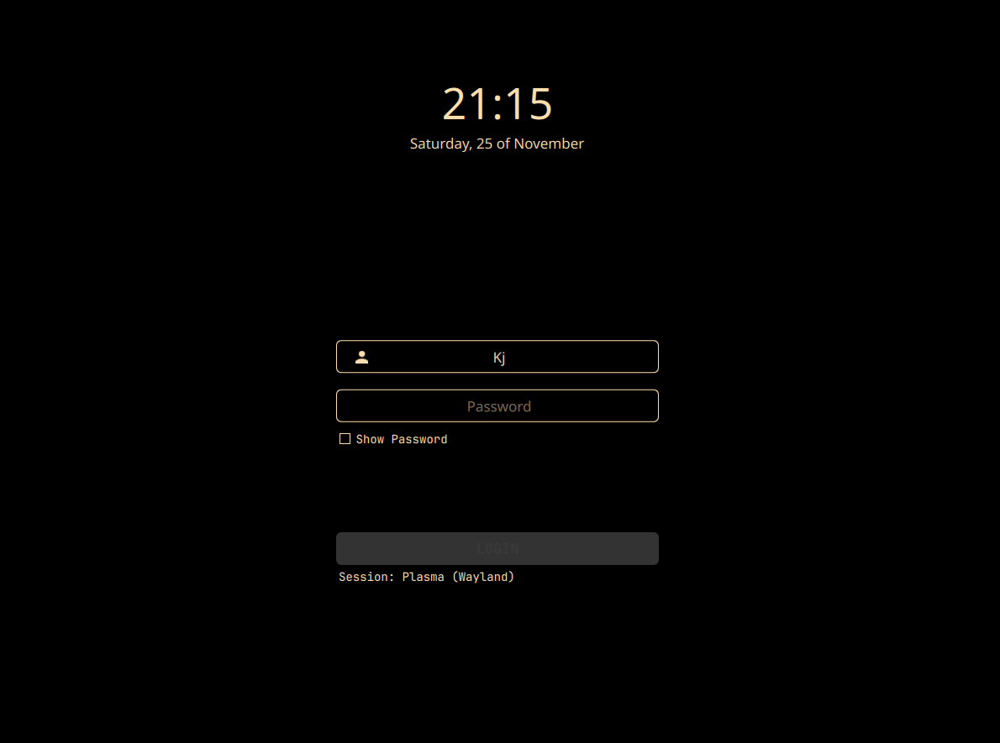

# Dark Chocolate login theme for SDDM

> Forked from [sugar dark](https://github.com/MarianArlt/sddm-sugar-dark)



To learn how to control sugar levels you should check the [Sugar Wiki on Github](https://github.com/MarianArlt/sddm-sugar-light/wiki/Before-you-begin) or the very well documented and included [`theme.conf`](theme.conf).

## Dependencies

[`sddm >= 0.18.0`](https://github.com/sddm/sddm), [`qt5 >= 5.11.0`](http://doc.qt.io/qt-5/index.html), [`qt5-quickcontrols2 >= 5.11.0`](http://doc.qt.io/qt-5/qtquickcontrols2-index.html), [`qt5-svg >= 5.11.0`](https://doc.qt.io/qt-5/qtsvg-index.html)

*Make sure these are up to date!*

### Installing the theme

```bash
git clone https://github.com/KJone1/sddm-dark-chocolate.git /usr/share/sddm/themes
```

edit /etc/sddm.conf.d/sddm.conf
In the `[Theme]` section add the themes name: `Current=sddm-dark-chocolate`

## Legal Notice

Copyright (C) 2018 Marian Arlt.  

Sugar Dark is free software: you can redistribute it and/or modify it under the terms of the GNU General Public License as published by the Free Software Foundation, either version 3 of the License, or (at your option) any later version.  

Sugar Dark is distributed in the hope that it will be useful, but WITHOUT ANY WARRANTY; without even the implied warranty of MERCHANTABILITY or FITNESS FOR A PARTICULAR PURPOSE. See the GNU General Public License for more details.  

You should have received a copy of the GNU General Public License along with Sugar Dark. If not, see <https://www.gnu.org/licenses/>.

[Mockup psd created by Qeaql-studio - Freepik.com](https://www.freepik.com/free-photos-vectors/mockup)

## Other awesome projects

- [Chili—the hottest login theme for KDE Plasma](https://www.opendesktop.org/p/1214121)
- [Chili stand-alone fork for SDDM only](https://www.opendesktop.org/p/1240784)
- [Flat OSX like aurorae window decorations for your Linux desktop](https://www.opendesktop.org/p/1199822) and [its high contrast version](https://www.opendesktop.org/p/1246756)
- [Finely crafted folder icons for Linux](https://www.opendesktop.org/p/1228310)
- [Inline clock widget for KDE Plasma](https://www.opendesktop.org/p/1245902)

## Motivate a developer

In the past years I have spent quite some hours on open source projects. If you are the type of person who digs attention to detail, know how much work is involved in it and/or simply likes to support makers with a coffee or a beer I would greatly appreciate your donation on my [PayPayl](https://www.paypal.me/marianarlt) account.  
Alternatively downloading my themes directly from opendesktop or with the kde sddm system settings module will at least help me a little to be able to attend your issues and requests.  
Please consider helping developers you think are worth a penny or two, literally.
